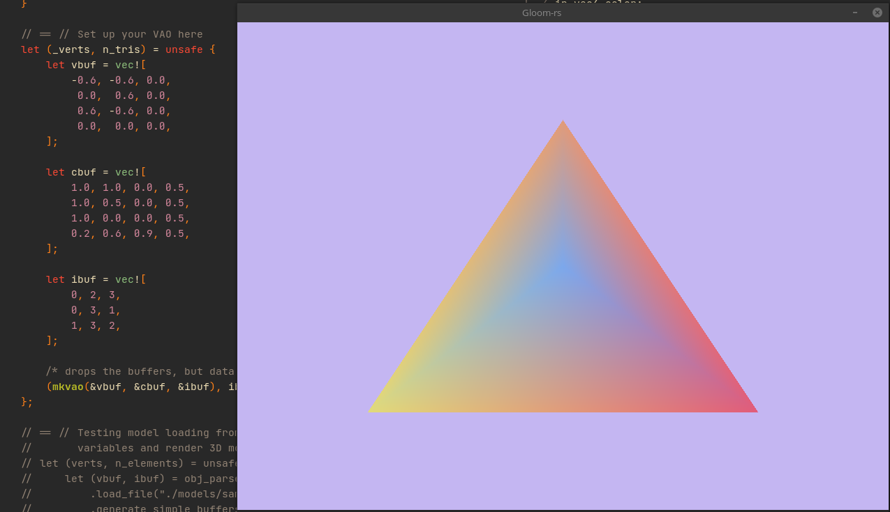
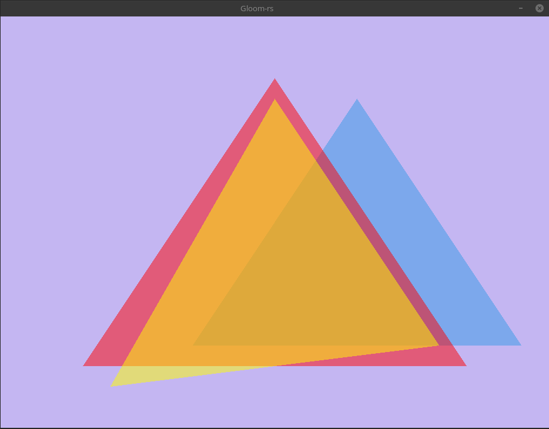
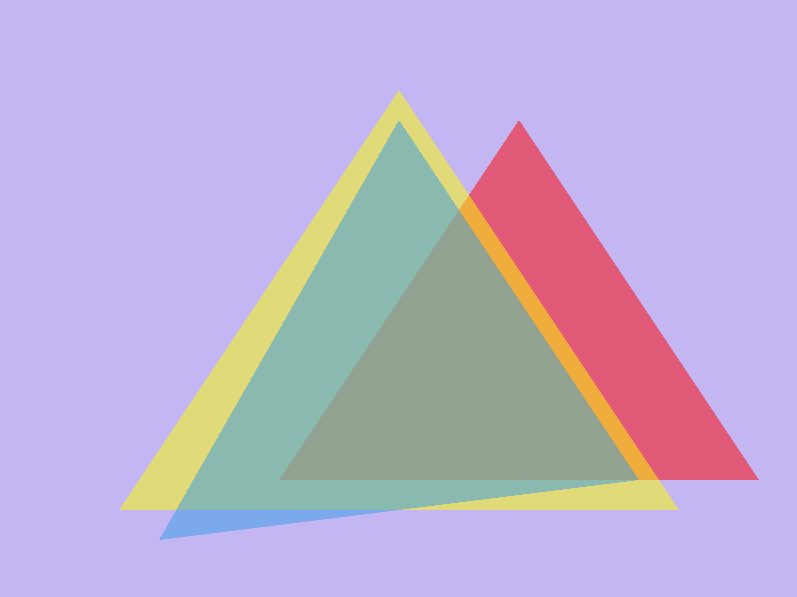
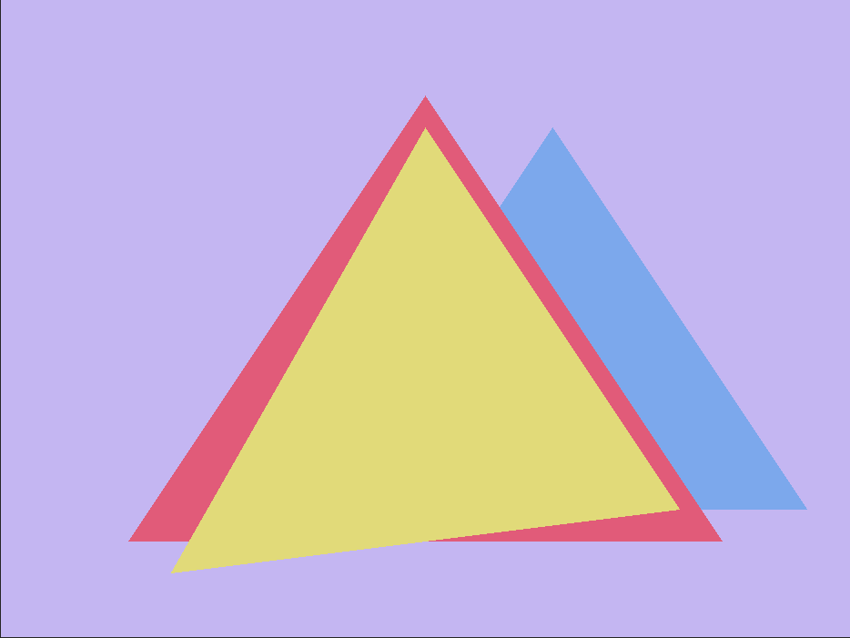

---
# These are meta-variables defined with YAML syntax, change them as you wish.
# see https://pandoc.org/MANUAL.html#variables
title: TDT4195 Assignment X
author:
- Steffen Haug
date: \today # This is a latex command, ignored for HTML output
lang: en-US
papersize: a4
geometry: margin=4cm
toc: false
toc-title: "List of Contents"
toc-depth: 2
numbersections: true
colorlinks: true
links-as-notes: true
# The document is following the break written using Markdown syntax
---

<!--
This is a HTML-style comment, not visible in the final PDF.
-->

# Task 1.b.
This scene has 3 triangles with some shared verteces, all with different colors,
demonstrating that colors get interpolated between verteces giving a "fading" effect.

# Task 2.a. and 2.b.
This scene has 3 partially transparent, partially overlapping (from the cameras 
perspective) triangles, demonstrating the blending of colors in the areas where
they overlap.

If we change the order the colors get blended (i), we can see that the resulting blended color
changes. The "most recently" blended color is the most prevalent in this case because the
colors have relatively high alpha value.

And in general it will be the case that blending in a different order would produce
a different color. This can easily be checked using the blending formula (for example
with Wolfram Alpha or just plugging in some arbitrary values to produce a contradiction)
but since the pictures already show this effect i will keep the report brief and not
prove this.

If we change the _order the triangles are drawn_ (ii), we get a different result.
To be very clear, what i mean is that the triangles are _no longer_ drawn from back to
front from the cameras perspective. Here we can see that the colours are not blended
at all.

The reason for this is very simple: If a fragment does not pass the depth test it
will not get drawn, and the presence of transparency does not change this.

Even if we _did_ blend the colors out of order it would not be possible to produce 
a "natural" looking blend, since (as we know from the previous task) the colours
could not look the same if blended out of order.

# Task 3.b.
To summarize:

* Changing $b,d$ (off-diagonal) causes sheering along the $x$- and $y$-axis respectively
* Changing $a,e$ (on-diagonal) causes stretching along the $x$- and $y$-axis respectively
* Changing $c,f$ causes translation along the $x$- and $y$-axis respectively, and a weird distortion effect by the edges

The distortion effect was somewhat unexpected, because the matrix we get by
modifying only $c,f$ and leaving the rest equal to the identiry matrix is of
course (as we know from theory) just a translation transformation.
The effect can most easily be described as a "zoom" as things approached the
edges of the screen.

Just for fun, i wanted to check the determinant of the matrix. It is $-bd+ea$.
As we know from linear algebra, the absolute value of the determinant of a matrix
tells us how much the area of a shape changes when subject to the transformation
defined by it. The fact that $c$ and $f$ is absent from the determinant proves
that it _should absolutely not_ have an effect on the area of a shape in the $xy$-plane,
so the distortion i can see has to be caused by something else.

We can see similar
effects if we use ridicolously big FOV values with a perspective projection, but
i didn't use a perspective projection yet so I'm really quite clueless of what
could cause this. And to add to this, when i sent a `glm` translation matrix
as a uniform in the next step everything looks right.

# Task 3.c.
Simply put, these transformations (if we only change one variable at a time)
are just scaling, sheering and translations, and those are simply not rotations.

We could actually make a rotation-matrix (arond the $z$-axis) by letting
$a=\cos t, b=-\sin t, c = 0, d = \sin t, e = \cos t$, and $f = 0$, and this would
give the effect of spinning the whole scene in a circle in front of the camera.
But this obviously doesn't count as changing the values in the matrix "one at a time"
as the problem states.

# Task 4.
This is not specified to be included in the report, but i figured id make some quick
notes on how the camera is implemented to show some understanding of the linear algebra.

First and foremost: The keybinds are **WASD** to move around, **HJKL** (vim bindings)
to look around, **I** to fly up and **N** to fly down (just some random keys close to **HJKL**).

The actions of the keys are interpreted in the simplest possible way; just mutating
a camera-struct allocated on the stack. This struct contains all the values required
to calculate the transfomation from world- to view-space ($xyz$ and yaw/pitch angles $\rho,\vartheta$).

The transformations need to be applied to the verteces so that the translation happens
before the rotations (i. e. the camera is at the origin when we do the rotation, so the
world is rotated around the camera). That is pretty obvious if you know what the
rotation matrices actually do.

Getting the rotation matrices right requires a bit more thinking (or a 50/50 guess ;-P),
but the simple way to think about it is this: No matter how steeply you are pointing the
camera, you need to turn the same amount in the $xz$-plane to face the $z$-axis, so this transformation is
safe to do without thinking about the $x$-axis, and for that reason we do this first.

Only once the camera is centered at the origin and facing along the $yz$-plane can we
rotate around the $x$-axis. This leads to the application order $P \circ Y \circ T$.

# Task 5.
Just briefly, since this is not specified to be included in the report, and additionally is optional.
I made this similar to minecraft creative-flying in the sense that there is still special keys to go up/down and
only the cameras yaw is taken into account to assume "forward" is in the direction the camera is
pointing in the $xz$-plane. Maybe this is cheating since it makes it pretty close to trivial, but
I find this a bit easier to control.

To calculate this, simply apply a rotation matrix of $-\rho$ to $\hat x$ and $\hat z$ to get a new basis
for the $xz$-plane point in the direction of- and orthogonal to the camera direction, and add these scaled
by `delta_time` to the cameras current position.
