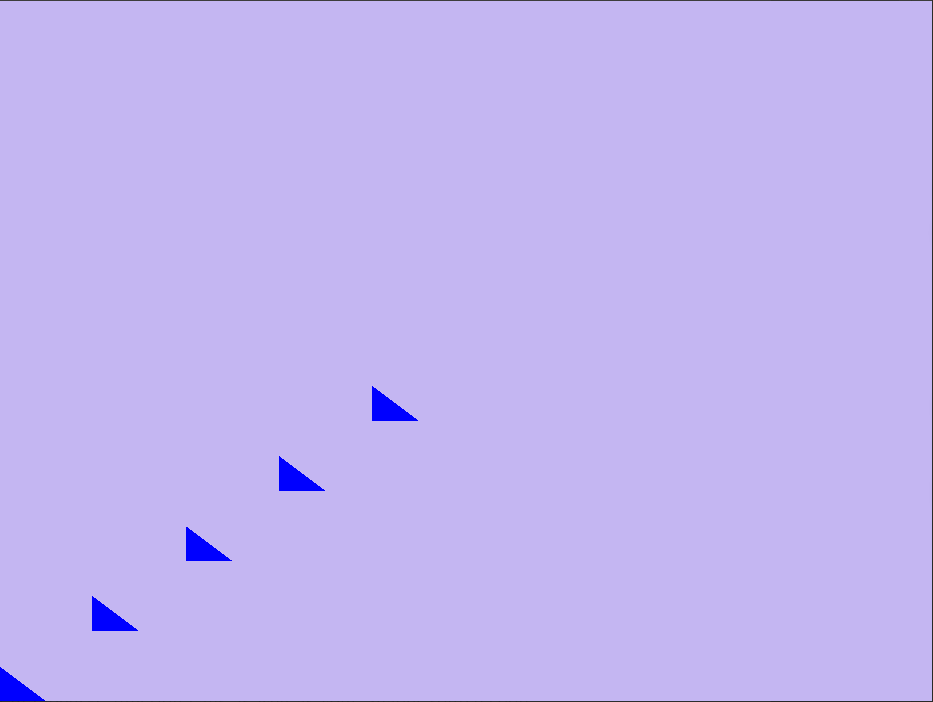
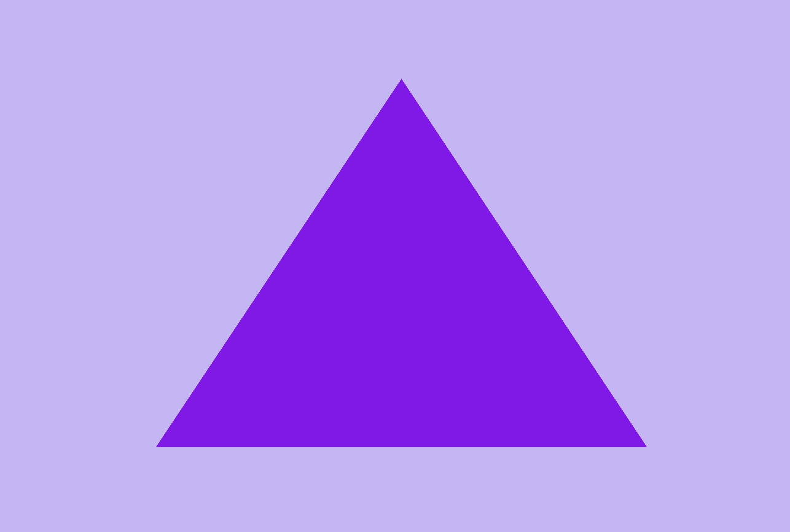

---
# These are meta-variables defined with YAML syntax, change them as you wish.
# see https://pandoc.org/MANUAL.html#variables
title: TDT4195 Assignment 1
author:
- Andreas Klavenes Berg
- Steffen André Haug
date: \today # This is a latex command, ignored for HTML output
lang: en-US
papersize: a4
geometry: margin=4cm
toc: false
toc-title: "List of Contents"
toc-depth: 2
numbersections: false
colorlinks: true
links-as-notes: true
# The document is following the break written using Markdown syntax
---

## Task 1c



## Task 2 

### a: Clipping


1. We see in the above screenshot that parts of the triangle have not been drawn, notably the far and and the near end. The blue colour value is taking from the z-position to demonstrate the depth. The phenonemon is called clipping.
2. Clipping happens when a shape goes outside the ±1.0 unit bounding box that defines the viewport.
3. The purpose of clipping is to avoid spending resources on calculating fragments that will not eventually appear on screen, because they are not inside the bounding box that we have defined as our viewport.

### b: Backface culling


Changing the order of the indices to clockwise order makes the triangles disappear. This happens because backface culling is enabled, meaning that faces that are expected to be backsides, i.e. only visible inside a closed model, are ignored to save resources. The rule for backface culling is that any primitive whose normal is pointing away from the camera is removed from the pipeline.

### c: Theoretical questions

1. *Why does the depth buffer need to be reset each frame?*
    - The depth buffer is used in the depth test by starting far out and updating with the closest fragment to the camera at any point. This means the buffer has been mutated and must be reset to a high value for each frame in order to work.
2. *In which situation can the fragment shader be executed multiple times for the same pixel?*
    - Two main cases that can cause the fragment shader to be executed multiple times for the same pixel are multisampling (anti-aliasing) and overlapping triangles. The calling of the fragment shader multiple times for overlapping triangles happens because the depth test that culls hidden faces is done after the fragment shader has been called.
3. *What are the two most commonly used types of shaders? What are the responsibilities of each of them?*
    - The two most commonly used types of shaders are vertex and fragment shaders.
    - The vertex shader transforms the model from the model coordinate system into positions for drawing on the screen.
    - The fragment shader runs once per fragment, i.e. approximately once per pixel, in order to set its colour.
4. *Why is it common to use an index buffer to specify which vertices should be connected into triangles, as opposed to relying on the order in which vertices are specified into this function?*
    - Using an index buffer to select vertices from the vertex buffer can save a lot of memory, as most vertices in a model appear in multiple triangles. Even in a simple cube, one vertex can be a part of up to six triangles.
5. *While the last input of `gl::VertexAttribPointer()` is a pointer, usually a null pointer is passed in. Describe a situation in which you would pass a non-zero value into this function.*
    - The last parameter is an `offset`. Usually, all attributes after the first one also needs to pass the offset of the attribute. If the vertex attributes consist of position and texture mapping `[x, y, z, u, v]`, all being 4 byte floats, then the texture map would be at an offset `3 * 4 = 12`.

### d: Mirror scene


Mirroring the scene is accomplished by mirroring the coordinates in the shader before passing them to `gl_Position`:

```glsl
gl_Position = vec4(-position.x, -position.y, position.z, 1.0f);
```




## Task 3 - bonus tasks

### Using gl_FragCoord to create checkerboard

```glsl
/* Assumes fixed resolution 800x800. */
vec2 uv = gl_FragCoord.xy / 800.0;
float M = 100;
float p = mod(M*uv.x, 2);
float q = mod(M*uv.y, 2);

float Q = 1.0; /* white */
/* p,q both > 1 or both < 1 => black. */
if (p > 1.0 && q > 1.0 || p < 1.0 && q < 1.0) {
    Q = 0.0;
}
```


### Draw a spiral

```glsl
/* Check N revolutions. */
int N = 10;
for (int i = 0; i < N; i++) {
    float delta = rho - phi - (6.28 * float(i));

    float epsilon = 1.0;

    if (abs(delta) < epsilon) {
        color = vec4(c, 1.0-abs(delta));
        return;
    }
}
```


### Draw a shape and have its colour change over time.

Skipped. Would have solved by adding a `uniform float t`, connected to `color` and gradually change it in the main loop.

### Manually rasterized triangle

Manually rasterised triangle, using the following shader. Three functions describing the shape are using to deside what to draw.

```glsl
#version 430 core

in vec2 v_position;
out vec4 color;

// Functions describing triangle
float line_1(float x) { return -1.6 * x + 0.5; }
float line_2(float x) { return  1.6 * x + 0.5; }
float line_3(float x) { return  0.0 * x - 0.35; }

// Colour of the triangle
vec3 tricol = vec3(0.2, 0.4, 0.7);

void main()
{
    // Calculate the boolean draw
    float draw = float(
        line_1(v_position.x) >= v_position.y
        && line_2(v_position.x) >= v_position.y
        && line_3(v_position.x) <= v_position.y
    );
    // Use draw to set one of the colours to 0 and select the other
    color = vec4(
        max(draw * tricol.x, float(!bool(draw))*-(-2+v_position.x+v_position.y)/2),
        max(draw * tricol.y, float(!bool(draw))*v_position.x),
        max(draw * tricol.z, float(!bool(draw))*v_position.y),
        1.0f
    );
}
```


### Obj file parsing

Implemented a simple parser for the `obj` file format, loading the data into an `obj_parser::ObjBuilder`. In order to draw the model with the current logic in `main`, we added the `generate_simple_buffers` function to discard all extra information and return only vertices and indices. Following is a simple model created in Blender, and the resulting frame.


### Sine function

```glsl
#version 430 core

in vec2 v_position;
out vec4 color;

void main()
{
    if (abs(v_position.y - 0.5 * sin(5.0 * v_position.x)) < .02) {
        color = vec4(v_position, 1.0f, 1.0f);
    } else {
        color = vec4(0);
    }
}
```

